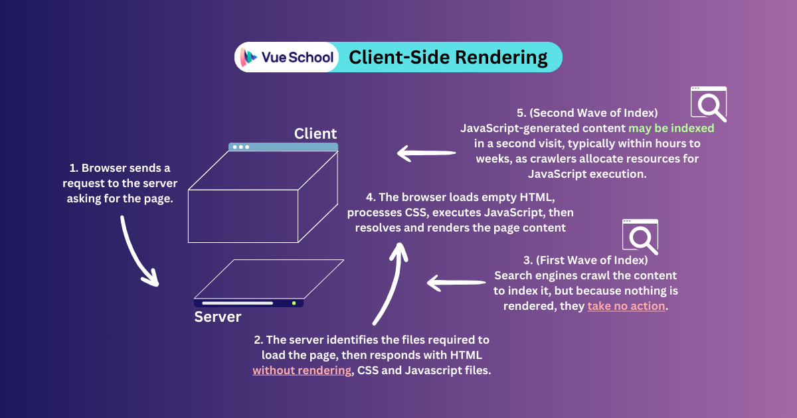
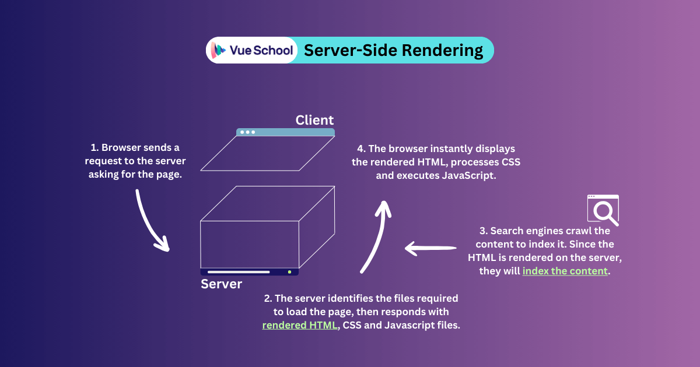
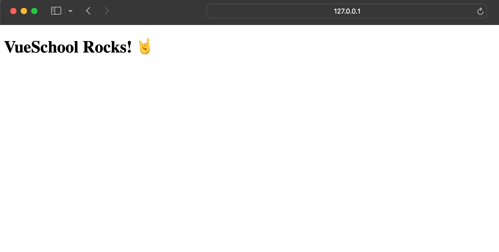
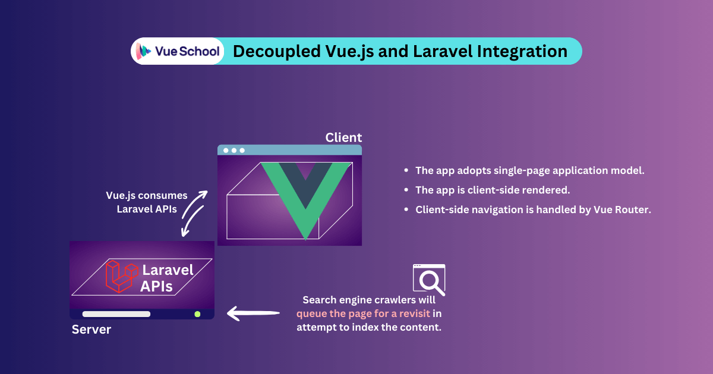
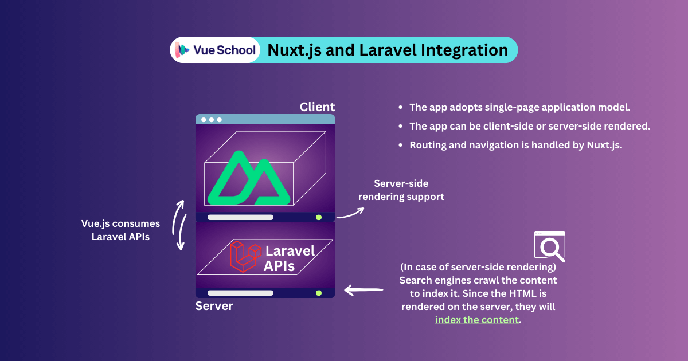
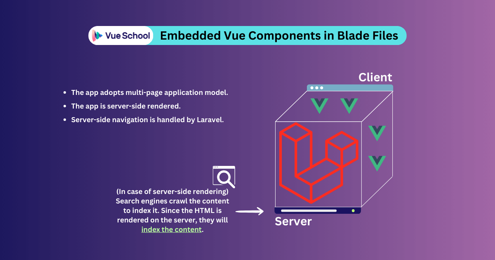
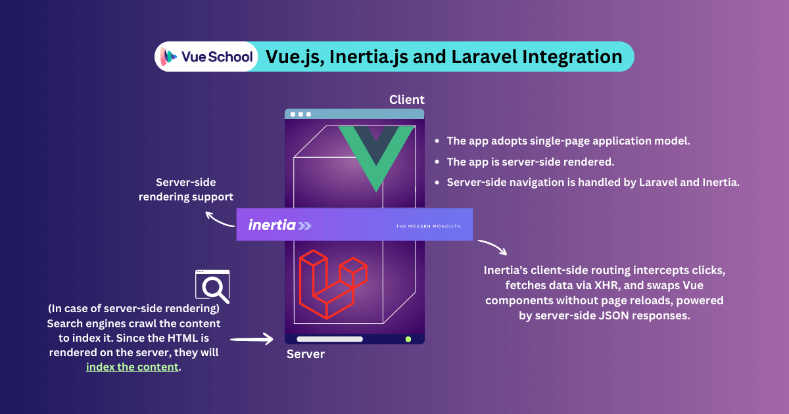
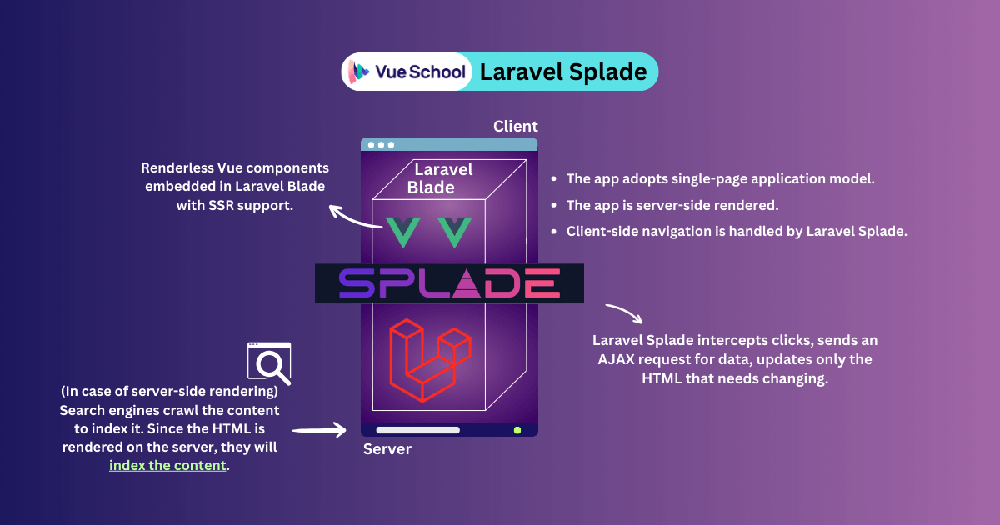

# Beneficios de usar Vuejs con Laravel

<p>  
La colaboración entre Vue.js y Laravel va más allá de una simple conveniencia; es una alianza estratégica forjada en el fuego de las necesidades del desarrollo web moderno.
</p>

- Aplicaciones de una sola página: Vue.js añade dinamismo al sólido backend de Laravel mediante la reactividad y la manipulación del DOM virtual, creando SPAs que se sienten nativas y son extremadamente rápidas. Esta colaboración elimina las recargas de página torpes y las interacciones lentas, ofreciendo un mayor compromiso del usuario, una carga reducida del servidor y una experiencia global más fluida.
- Magia de recarga en caliente: Tanto Vue como Laravel admiten Vite, ofreciendo la función de reemplazo de módulos en caliente (Hot Module Replacement). Esta función refleja instantáneamente los cambios de código en el navegador sin necesidad de recargar la página, lo que ahorra a los desarrolladores un valioso tiempo y esfuerzo.
- Renderización en el lado del servidor: Vue.js y Laravel gestionan estratégicamente los desafíos de SEO mediante un enfoque coordinado. La renderización en el lado del servidor de Laravel pre-renderiza el contenido HTML para los motores de búsqueda, garantizando un SEO óptimo. Simultáneamente, Vue.js maneja la interactividad del lado del cliente, creando un enfoque que armoniza las prioridades de SEO con las experiencias de usuario dinámicas.
- Serenidad en la gestión del estado: La gestión del estado del cliente de la aplicación puede ser caótica, pero herramientas como Pinia lo hacen sencillo. Alternativamente, si prefieres la gestión del estado en el lado del servidor, Inertia.js toma eficientemente las riendas.
- Coro de la comunidad: ¡Aprovecha el poder de la comunidad! Vue.js y Laravel cuentan con comunidades vibrantes con un soporte incomparable, una extensa documentación y un flujo continuo de bibliotecas y paquetes innovadores. Este entorno colaborativo empodera a los desarrolladores para conquistar desafíos, compartir conocimientos y explorar nuevas posibilidades.
- Bases a prueba de futuro: Con Vue.js y Laravel evolucionando constantemente para abrazar las últimas tecnologías y tendencias web, tus aplicaciones permanecen relevantes y adaptables. Este enfoque visionario asegura que tus habilidades sigan siendo valiosas y que tus proyectos superen la prueba del tiempo.

    <p>
  These are a few benefits of combining Vue.js and Laravel. Using their powers together, developers can make fast, easy-to-manage web apps that captivate users and outshine the competition.
  However, echoing the wise words of Uncle Ben to Spiderman, "With great power comes great responsibility". When working with a client-side JavaScript framework like Vue alongside a server-side PHP framework like Laravel, certain responsibilities require careful consideration.
    </p>

  # Modos de renderización

    <p>
      Para tomar una decisión bien fundamentada sobre la integración de Vue.js con Laravel para tu caso de uso específico, es crucial comprender las diferencias entre los diferentes modos de renderizado.
    </p>

  ## Client-Side Rendering

  

    <p>
    Al construir una aplicación renderizada en el lado del cliente (CSR), el papel principal del servidor es actuar como proveedor de archivos. Entrega HTML vacío sin renderizar junto con los activos CSS y JavaScript esenciales al navegador.

Una vez que el servidor responde, los rastreadores de motores de búsqueda interceptan la respuesta para leer e indexar el contenido. Sin embargo, cuando encuentran un HTML vacío, algunos de ellos pueden programar una segunda visita, una vez que tengan los recursos disponibles para ejecutar JavaScript. Esto puede resultar en retrasos en la indexación que van desde horas hasta semanas.

Finalmente, una vez que el navegador está equipado con los archivos requeridos, toma el centro de atención, procesando y analizando el HTML, aplicando los estilos CSS y ejecutando el código JavaScript.

A partir de este momento, JavaScript realiza una serie de tareas, incluyendo la población de la página con datos, la creación de elementos interactivos, la gestión de procesos de autenticación y, en el caso de aplicaciones de una sola página (SPAs), el manejo de la navegación del lado del cliente sin recargas de página completas.

  </p>

## Server-Side Rendering



  <p>
  En las aplicaciones renderizadas en el lado del servidor (SSR), el servidor crea una página HTML completamente renderizada antes de enviarla al navegador. Esto significa que el servidor se encarga de las tareas iniciales de obtener datos y poblar el contenido. El resultado es una página web completa, lista para ser mostrada inmediatamente al llegar al navegador.

Este enfoque asegura que los rastreadores de motores de búsqueda puedan consumir e indexar el contenido sin esfuerzo y sin necesidad de segundas visitas.

Si bien el navegador aún recibe y ejecuta JavaScript en SSR, su papel cambia principalmente a mejorar la interactividad y gestionar las actualizaciones dinámicas que ocurren después de la carga inicial de la página. Esto incluye manejar las interacciones del usuario, cargar contenido adicional o gestionar el enrutamiento del lado del cliente en SPAs.

Al delegar el trabajo de renderizado inicial al servidor, SSR a menudo puede llevar a un rendimiento optimizado y a una mejora en el SEO.

La colaboración entre Vue.js y Laravel permite a los desarrolladores construir aplicaciones tanto CSR como SSR. Sin embargo, no es un enfoque único para todos. En cambio, ofrece una variedad de métodos de integración, cada uno con sus propios beneficios y desafíos. El método de integración que elijas jugará un papel crucial en determinar la técnica de renderizado de tu aplicación y si adopta el modelo SPA o MPA.

  </p>

# Método 1: Single Blade Hosting a Vue.js App


  <p>
  En este método de integración basado en API, un único archivo blade de Laravel actúa como el host para toda la aplicación Vue.js. Ambos frameworks coexisten armónicamente dentro del mismo directorio de proyecto, facilitado por el poder del plugin oficial de Vite para Vue.

A pesar de compartir el mismo directorio de proyecto y el mismo dominio, este enfoque aún adopta el principio de separación de preocupaciones, permitiendo que Vue.js funcione como una aplicación renderizada en el lado del cliente mientras consume las APIs de Laravel.

Además, Vue Router, la solución de enrutamiento oficial para Vue, gestionará la navegación del lado del cliente de forma transparente, simplificando el proceso de creación de SPAs. Si estás ansioso por convertirte en un experto en Vue Router, considera explorar nuestro curso dedicado en VueSchool. Está diseñado para equiparte con las habilidades para dominar Vue Router sin esfuerzo.

  </p>

## Guia de integracion

1.- Primero crearemos un proyecto nuevo de Laravel con el comando

```
composer create-project laravel/laravel example-app
```

Luego instalamos las dependencias relacionadas con npm

```
npm install
```

Ya estamos listos para añadir Vue

```
npm install vue@next vue-router@4 @vitejs/plugin-vue
```

El comando anterior añade Vue, Vue Router and Vite’s official plugin para Vue 3.

```
// package.json
"dependencies": {
  "@vitejs/plugin-vue": "^4.6.0",
  "vue": "^3.2.36",
  "vue-router": "^4.2.5"
}
```

Para empezar a usar Vue en Laravel, debemos agregar el plugin de Vite para Vue al array de plugins dentro del archivo vite.config.js. El código final se verá así:

```
import { defineConfig } from "vite";
import laravel from "laravel-vite-plugin";
import vue from "@vitejs/plugin-vue";

export default defineConfig({
    plugins: [
        vue(),
        laravel({
            input: ["resources/css/app.css", "resources/js/app.js"],
            refresh: true,
        }),
    ],
    resolve: {
        alias: {
            vue: "vue/dist/vue.esm-bundler.js",
        },
    },
});
```

Dirígete a ./resources/js y crea un nuevo archivo App.vue. Este archivo servirá como punto de entrada para nuestra aplicación Vue.js.

```
<template>
  <h1>
      VueSchool Rocks! 🤘
  </h1>
</template>
```

Es hora de crear una nueva instancia de aplicación Vue en nuestro proyecto Laravel. Para hacerlo, necesitaremos modificar el archivo ./resources/js/app.js y agregar lo siguiente:

```
import "./bootstrap";
import { createApp } from "vue";

import App from "./App.vue";

createApp(App).mount("#app");
```

Esto montará nuestra aplicación Vue dentro de un elemento con el id "app". Creemos ese <div> dentro del <body> del archivo ./resources/views/welcome.blade.php. Este archivo Blade que contiene nuestra aplicación Vue es el único archivo de Laravel que se expondrá al navegador.

```
<body>
    <div id="app"></div>
</body>
```

También debemos importar nuestro archivo ./resources/js/app.js usando la directiva Blade @vite().

```
<head>
    @vite(['resources/js/app.js'])
</head>

<body>
    <div id="app"></div>
</body>
```

¡Con eso, tenemos Vue funcionando con Laravel 🥳! Podemos probarlo ejecutando npm run dev y php artisan serve.



Todavía necesitamos convertirlo en una aplicación de una sola página dinámica. Para lograr esto, usaremos Vue Router. Creemos un nuevo archivo ./resources/js/router.js para definir el enrutador:

```
import { createRouter, createWebHistory } from "vue-router";

const routes = [];

export default createRouter({
    history: createWebHistory(),
    routes,
});
```

El siguiente paso es integrar el enrutador que acabamos de crear con nuestra instancia de Vue dentro del archivo ./resources/js/app.js

```
import "./bootstrap";
import router from "./router/router";
import { createApp } from "vue";

import App from "./App.vue";

createApp(App).use(router).mount("#app");
```

Entonces, ahora necesitamos un directorio ./resources/js/Pages/ que contendrá nuestros componentes de ruta. Primero creamos ./resources/js/Pages/HomeRoute.vue con un router-link para probar la navegación interna cuando hayamos terminado:

```
<template>
    <div>
        <h1>HOME</h1>
        <router-link to="/test"> Take me to Test page </router-link>
    </div>
</template>
```

Luego creamos ./resources/js/Pages/TestRoute.vue

```
<template>
    <h1>I'm here to test!</h1>
</template>
```

Luego, carga perezosamente los nuevos componentes de ruta en el archivo del enrutador ./resources/js/router.js

```
import { createRouter, createWebHistory } from "vue-router";

const routes = [
    {
        path: "/",
        component: () => import("./Pages/HomeRoute.vue"),
    },
    {
        path: "/test",
        component: () => import("./Pages/TestRoute.vue"),
    },
];

export default createRouter({
    history: createWebHistory(),
    routes,
});
```

Vale la pena mencionar que podemos usar el paquete unplugin-vue-router para habilitar la función de enrutamiento basado en archivos. Pero para este tutorial, nos quedaremos con el enfoque oficial de Vue Router.

Finalmente, ajustamos el código dentro del archivo de entrada de Vue para que sea dinámico. Afortunadamente, Vue Router proporciona el componente integrado RouterView, que expone slots que podemos aprovechar para renderizar dinámicamente los componentes de ruta.

Dirígete a ./resources/js/App.vue y modifícalo de la siguiente manera:

```
<template>
    <router-view v-slot="{ Component, route }">
        <div :key="route.name">
            <Component :is="Component" />
        </div>
    </router-view>
</template>
```

Ahora, si ejecutamos npm run dev y php artisan serve en la terminal, y hacemos clic en el enlace para navegar a /test, veremos que funciona como se esperaba con la navegación del lado del cliente. Pero aquí está el truco, si hacemos un refresco duro, Laravel devolverá un error "404 No encontrado". Esto sucede porque no tenemos rutas web definidas en Laravel.

Para superar este desafío, podemos dirigirnos a ./routes/web.php y definir una sola ruta que capture todas las rutas válidas y use el archivo de entrada Blade que contiene nuestra aplicación Vue.

```
Route::get('/{vue_capture?}', function () {
    return view('welcome');
})->where('vue_capture', '[\/\w\.-]*');
```

Con eso hecho, el refresco duro ya no arruinará nuestra aplicación. Sin embargo, vale la pena mencionar que las páginas 404 aún deben ser manejadas utilizando Vue Router. Puedes seguir las instrucciones en la lección gratuita "404-not-found-page" en VueSchool para manejar este escenario como un profesional.

En este punto, aún no tenemos un canal de comunicación entre los componentes del lado del cliente de Vue y el backend de Laravel. Para esto, podemos usar axios como nuestro cliente HTTP basado en promesas para el navegador.

```
npm install axios
```

Vamos a crear rápidamente un endpoint de API de prueba en Laravel y consumirlo desde un componente Vue. Dentro de ./routes/api.php, agregaremos un nuevo endpoint de API.

```
Route::get("/test-me", function () {
    return 'Hello from Laravel!';
});
```

Luego, consumiremos este nuevo endpoint de API desde el componente ./resources/js/Pages/HomeRoute.vue usando axios. Prepararemos un botón que activará la función getValue() que enviará una solicitud get al endpoint. También crearé un ref para almacenar el valor de la respuesta.

```
<template>
    <div>
        <h1>HOME</h1>
        <router-link to="/test"> Take me to Test page </router-link>
        <button @click.prevent="tiggerEndpoint">Trigger Endpoint</button>
        <p v-if="response">{{ response.data }}</p>
    </div>
</template>
```

Finalmente, usaremos script setup para crear la función y la variable ref

```
import axios from "axios";
import { ref } from "vue";

const response = ref();

const getValue = async () => {
    try {
        response.value = await axios.get("/api/test-me");
    } catch (error) {
        // Do something with the error
        console.log(error);
    }
};
```

Cuando ejecutemos la aplicación y una vez que se haga clic en el botón, la función getValue() activará el endpoint test-me y la respuesta se mostrará en el navegador.

### Resumen

Aquí tienes algunas ventajas y desafíos de integrar Vue con Laravel al anidar Vue en un único archivo Blade:

#### Ventajas

- Vue.js y Laravel comparten el mismo dominio y el mismo repositorio de git.
- Ambos frameworks coexisten en el mismo proyecto pero están organizados de manera ordenada en directorios separados.
- La aplicación es una aplicación de una sola página renderizada en el lado del cliente.
- No es necesario crear rutas web en Laravel; Vue Router se encarga de la navegación del lado del cliente, y Axios obtiene datos de las APIs de Laravel.
- Si se necesita una aplicación móvil, se pueden utilizar los mismos puntos finales de la API para la obtención y manipulación de datos.

#### Desafios

- Los motores de búsqueda dependen de una segunda ola de indexación retrasada, que puede tardar desde horas hasta semanas.
- El contenido de la página puede experimentar tiempos de carga más largos, ya que el navegador es responsable del procesamiento y renderizado del lado del cliente.
- La gestión del lado del cliente de la navegación, los guardias de ruta y otras tareas relacionadas con el enrutamiento introduce una complejidad adicional para los desarrolladores de Laravel.

# Método 2: Decoupled Vue.js and Laravel Integration



<p>
Este enfoque también se basa en API y tiene un resultado similar al Método 1, creando una aplicación dinámica de una sola página alimentada por Vue.js y Laravel. Sin embargo, lleva la separación de preocupaciones a un nuevo nivel, tratando a Vue.js y Laravel como proyectos totalmente independientes.
</p>

## Guía de integración

<p>
La integración refleja la implementación del Método 1 conceptualmente, la diferencia clave radica en la independencia de Vue.js y Laravel. Ambos frameworks existen como proyectos separados y se despliegan en diferentes dominios. Vue se hace cargo completo de la estructura y el renderizado de la aplicación, mientras que Laravel se convierte en un potente motor de API, creando puntos finales dedicados para el intercambio dinámico de datos e interacciones.

Por lo tanto, los pasos para implementar tu proyecto con este enfoque son los siguientes:

</p>

- Create distinct projects: Crea una aplicación independiente de Vue.js y una aplicación separada de Laravel.
- Craft dedicated APIs: Dentro de Laravel, diseña puntos finales de API para servir datos y facilitar interacciones.
- Consume APIs from Vue: Consuma las API de Laravel utilizando Axios u otras bibliotecas HTTP similares.

#### Resumen

Este enfoque refleja el rendimiento y la experiencia del usuario del Método 1, ofreciendo las mismas ventajas sin abordar ninguno de sus desafíos. La única diferencia radica en la flexibilidad organizativa.

Al separar los dos frameworks en proyectos distintos, se empodera a equipos dedicados para operar de forma independiente, permitiendo un desarrollo rápido del front-end sin afectar al backend estable de Laravel. Este enfoque es ideal para proyectos donde la agilidad organizativa y los ciclos de desarrollo independientes son cruciales.

Sin embargo, para aquellos que buscan un enfoque más integrado y fluido, exploraremos cómo Nuxt.js reduce la brecha entre Vue.js y Laravel en el Método 3.

# Método 3: Nuxt.js and Laravel Integration



<p>
En esta configuración, seguimos adoptando una integración desacoplada basada en API, pero también optamos por Nuxt.js en lugar de un Vue.js clásico.

Nuxt interactúa perfectamente con Laravel a través de APIs, ofreciendo una combinación única de dinamismo del lado del cliente y capacidades de renderizado en el lado del servidor (SSR). Además, Nuxt maneja las complejidades del enrutamiento del lado del cliente, simplificando el desarrollo y mejorando la experiencia del usuario.

Por otro lado, Laravel asume el papel de un sólido generador de APIs, proporcionando una base para que Nuxt consuma y transforme en contenido dinámico e interactivo dentro de la aplicación.

¿Interesado en profundizar en la integración de Nuxt y Laravel y descubrir todo su potencial? Nuestro curso "Laravel Backends for Vue.js 3" ofrece una guía completa, consejos prácticos e información experta para guiarte en cada paso.

</p>

## Guía de Integración

Los pasos de integración se alinean estrechamente con los Métodos 1 y 2, ya que mantenemos un enfoque consistente para consumir APIs de Laravel dentro de una aplicación Nuxt.js.

- Crear proyectos distintos: Crea una aplicación Nuxt.js independiente y una aplicación Laravel separada.
- Crear APIs dedicadas: Dentro de Laravel, diseña puntos finales de API para servir datos.
- Consumir APIs desde Vue: Consumir las APIs de Laravel utilizando Axios, bibliotecas HTTP similares o la función $fetch incorporada de Nuxt.

#### Resumen

Con este método, estamos abordando los desafíos introducidos en los 2 métodos anteriores. Sin embargo, requiere conocimientos previos de los fundamentos de Nuxt. ¿Todavía no eres un experto en Nuxt? ¡No te preocupes! VueSchool te respalda con un curso completo sobre los fundamentos de Nuxt.js.

Aquí tienes algunas ventajas y desafíos de integrar Nuxt.js con Laravel:

Ventajas:

- Contenido instantáneamente compatible con SEO disponible en el lado del servidor y cargas iniciales ultrarrápidas.
- Renderizado inteligente en el lado del servidor para tamaños de página más pequeños.
- Nuxt maneja las complejidades del enrutamiento del lado del cliente.
- Enfoque en el desarrollo de API y tareas del lado del servidor.
- Si se necesita una aplicación móvil, se pueden utilizar los mismos puntos finales de API para la obtención y manipulación de datos.
- Tanto la aplicación Nuxt como el backend de Laravel se despliegan y mantienen de forma independiente.

Desafíos:

- Se requieren conocimientos de Nuxt.js

# Método 4: Embedded Vue Components in Blade Files



<p>
Con los componentes de Vue.js integrados en archivos Blade, Laravel sirve como la aplicación principal. Esta estrategia preserva la sólida base arquitectónica de Laravel mientras incorpora componentes dinámicos de Vue.js, lo que resulta en una experiencia de usuario más atractiva sin sacrificar la familiaridad del desarrollo tradicional de Laravel de varias páginas y del lado del servidor.
</p>

## Guía de Integración

Comencemos integrando componentes de Vue dentro de Blade de Laravel. Primero, necesitamos seguir el mismo proceso de instalación para Vue en el Método 1, pero esta vez, sin instalar vue-router. El enrutamiento, junto con todo lo demás, será manejado por Laravel en el lado del servidor.

El siguiente paso es modificar el archivo ./resources/js/app.js y agregar lo siguiente:

```
import "./bootstrap";
import { createApp } from "vue";

createApp({}).mount("#app");
```

<p>
Vue buscará un < div > con el id "app" para usarlo como montura de la instancia de Vue. Crea ese < div > dentro del < body > del archivo ./resources/views/welcome.blade.php. También debemos importar nuestro archivo ./resources/js/app.js usando la directiva Blade @vite().
</p>

```
<head>
    @vite(['resources/js/app.js'])
</head>

<body>
    <div id="app"></div>
</body>
```

Ahora, necesitaremos un componente Vue para probar con ./resources/js/Components/TestComponent.vue

```
<template>
    <h1>I'm here to test!</h1>
</template>
```

Por supuesto, necesitamos registrar ese componente en nuestra instancia de Vue dentro de ./resources/js/app.js para empezar a usarlo

```
import "./bootstrap";

import { createApp } from "vue";
import TestComponent from "./Components/TestComponent.vue";

const app = createApp({});

app.component("test-component", TestComponent);

app.mount("#app");
```

¡Es hora de la verdad! Dirígete a ./resources/views/welcome.blade.php y comienza a usar el nuevo componente.

```
<body class="antialiased">
    <div id="app">
        <test-component></test-component>
    </div>
</body>
```

¡Voilà! Acabamos de hacer funcionar el componente Vue dentro del motor Blade de Laravel.

#### Resumen

Para proyectos de Laravel existentes que buscan un impulso dinámico, incrustar componentes Vue dentro de archivos Blade ofrece la combinación perfecta de familiaridad e innovación. Este enfoque aprovecha la base establecida de Laravel mientras integra de forma transparente la interactividad de Vue, creando una experiencia de usuario atractiva y compatible con SEO. Piénsalo como inyectar una dosis de dinamismo en tu aplicación Laravel existente, mejorando los recorridos de usuario sin sacrificar la estabilidad y la estructura que ya has construido.

# Método 5: Vue.js, Inertia.js and Laravel Integration



<p>
Inertia.js combina de forma transparente la agilidad del frontend de Vue.js con el sólido backend de Laravel, eliminando la necesidad de desarrollar API por separado. Laravel se encarga del enrutamiento, la hidratación de datos y la autenticación, mientras que Vue crea experiencias de usuario cautivadoras, recibiendo datos de forma sencilla a través de Inertia.

Con el renderizado en el lado del servidor, toda la aplicación se renderiza inicialmente en el servidor, garantizando un SEO óptimo y velocidades de carga inicial ultrarrápidas.

</p>

## Guía de Integración

La forma más rápida y mejor de instalar Inertia.js en Laravel es mediante el uso de uno de los kits de inicio oficiales de Laravel, Laravel Breeze o JetStream. Para esta guía, usaré Laravel Breeze.

Primero, crea un nuevo proyecto de Laravel.

```
composer create-project laravel/laravel example-app
```

Luego instalamos las dependecias de laravel

```
npm install
```

A continuación, usa composer para obtener Laravel Breeze con el siguiente comando:

```
composer require laravel/breeze --dev
```

Luego, instalamos Laravel Breeze con el siguiente comando:

```
php artisan breeze:install
```

<p>
Esto nos pedirá nuestra pila de frontend preferida, que seguramente elegiremos Vue.js con Inertia. Luego, preguntará si queremos incluir alguna de las siguientes características:

- Modo oscuro
- Inertia SSR
- Typescript (experimental)

Elegiremos "Inertia SSR" para asegurarnos de tener soporte de renderizado en el lado del servidor en nuestra aplicación de una sola página. Finalmente, nos preguntará si queremos elegir entre PHPUnit y Pest como framework de pruebas, siéntete libre de elegir el que prefieras.

Después de que la terminal haya terminado y todo esté cargado, podemos iniciar la aplicación con la función Inertia SSR construyendo la aplicación con npm run build, iniciando el servidor de nodos de Inertia con php artisan inertia:start-ssr y finalmente php artisan serve.

Por último, si intentamos hacer clic en cualquier enlace para navegar dentro de la aplicación, la navegación no provocará una actualización completa de la página. Esto se debe al componente Link de Inertia.

Si vamos a ./resources/js/Pages/welcome.vue, veremos que se importa un componente llamado Link de @inertiajs/vue3 y se utiliza para la navegación interna.

</p>

```
import { Link } from "@inertiajs/vue3";
```

Este componente es el enfoque mágico de Inertia para cambiar dinámicamente el contenido de la página sin forzar una recarga completa de la página.

```
<Link
    :href="route('dashboard')"
    >
        Dashboard
</Link>
```

Vamos a rastrear la implementación del enlace route('dashboard') hasta las rutas web de Laravel en ./routes/web.php

```
Route::get('/dashboard', function () {
    return Inertia::render('Dashboard');
})->middleware(['auth', 'verified'])->name('dashboard');
```

Lo único extraño que vemos en las rutas es el método Inertia::render.

Entonces, para crear un enlace Inertia, también necesitas crear una ruta correspondiente en el archivo web.php y usar el método Inertia::render para renderizar una página Vue desde el directorio ./resources/js/Pages/.

#### Resumen

Inertia te permite construir SPAs potenciadas por Vue sobre Laravel sin reescribir código del lado del servidor. Sigue utilizando el enrutamiento, controladores y obtención de datos de Laravel mientras creas interfaces de usuario dinámicas con componentes Vue.

La magia radica en el enrutamiento del lado del cliente. El componente <Link> de Inertia intercepta los clics, desencadena solicitudes XHR para obtener los datos del servidor. Luego, el servidor, reconociendo Inertia, envía un JSON mínimo con el nombre del nuevo componente Vue y sus propiedades. Inertia luego intercambia las vistas, actualizando el historial del navegador sin recargar la página por completo.

Básicamente, obtienes una experiencia fluida de SPA dentro del entorno de desarrollo familiar de Laravel. Así que olvídate de la reescritura y disfruta de lo mejor de ambos mundos: la potencia del lado del servidor y las interfaces de usuario dinámicas de Vue.

# Método 6: Laravel Splade



<p>
Como último método de integración que discutiremos en el artículo, aprovechamos Laravel Splade, una adición relativamente reciente al ecosistema de la comunidad Laravel.

Laravel Splade simplifica el desarrollo web moderno al combinar sin problemas las fortalezas de dos mundos: la simplicidad de las plantillas de Blade y la magia interactiva de Vue.js. Piensa en formularios dinámicos, actualizaciones en tiempo real y animaciones cautivadoras, todo integrado sin problemas en tu código Blade existente.

Splade adopta un enfoque único en comparación con Inertia.js. En lugar de depender únicamente de los Componentes de Archivo Único (SFCs) de Vue, invita a Vue con la función SSR a tus plantillas Blade, creando una experiencia similar a Inertia sin abandonar las plantillas Blade. Esto significa transiciones sin esfuerzo para los desarrolladores de Laravel, permitiéndote aprovechar tu experiencia existente en Blade mientras desbloqueas el poder del lado del cliente de Vue.

</p>

## Guía de Integración

Para comenzar con Splade, creemos un nuevo proyecto de Laravel.

```
composer create-project laravel/laravel example-app
```

Luego instalamos las dependecias de laravel

```
npm install
```

Ahora estamos listos para instalar laravel splade

```
composer require protonemedia/laravel-splade
php artisan splade:install
```

Esto instala Tailwind CSS v3.0 y Vue v3.0 en el frontend. En el backend, instala un Middleware de Ruta, un Manejador de Excepciones y prepara una vista predeterminada y su ruta.

A continuación, ejecutamos npm run dev y php artisan serve para iniciar nuestra aplicación de Laravel con Splade activado.

Ten en cuenta que si hacemos clic en cualquier enlace, no se activará una actualización completa de la página. En su lugar, se enviará una solicitud AJAX que devolverá solo el código HTML que necesita actualizarse.

Para agregar una nueva ruta, ve a ./routes/web.php y agrega tu ruta al grupo de middleware splade siguiendo la sintaxis a continuación:

```
Route::middleware(['splade'])->group(function () {
    Route::get('/', fn () => view('home'))->name('home');
});
```

Luego, al usar el componente integrado Link de Splade, la navegación interna no provocará una actualización completa de la página. Aquí tienes un ejemplo de cómo podemos usar este componente:

```
<Link href="/">Home</Link>
```

### Resumen

Splade te brinda casi las mismas ventajas que usar Vue, Inertia y Laravel. La principal diferencia es que es más amigable para los desarrolladores de Laravel porque puedes seguir utilizando las familiares plantillas Blade. También ofrece muchos componentes listos para ser utilizados dentro de tus plantillas Blade de inmediato. Siéntete libre de explorar la documentación completa para obtener más información.

Sin embargo, ten en cuenta que Splade todavía es bastante nuevo y tiene mucho margen de mejora. Por lo tanto, tómate tu tiempo para probarlo bien y evitar sorpresas en producción.

### Conclusión

En última instancia, la mejor manera de integrar Vue.js y Laravel depende de las necesidades específicas de tu proyecto. Pregúntate a ti mismo: ¿Es crucial el tiempo de desarrollo rápido? ¿Priorizas la optimización SEO? ¿O es una experiencia de usuario perfecta con actualizaciones mínimas de página tu principal prioridad?

Elige el método de integración que mejor se alinee con el propósito central de tu proyecto y tu propio nivel de comodidad en el desarrollo. Al hacerlo, construirás una aplicación web robusta, flexible y centrada en el usuario con Vue.js y Laravel.
